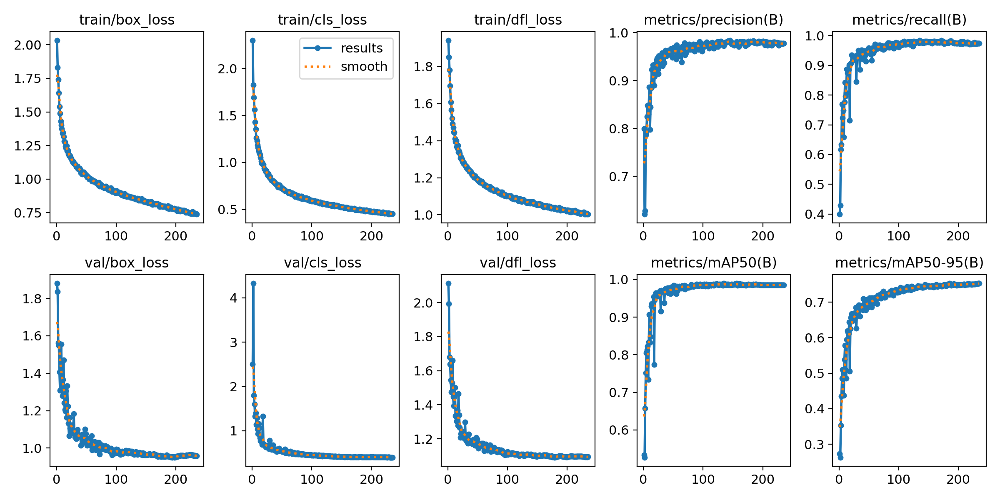
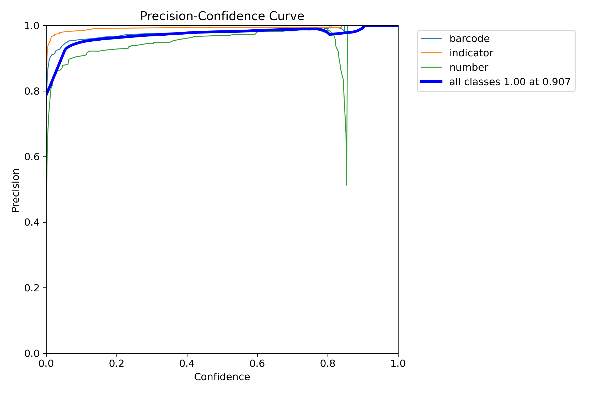
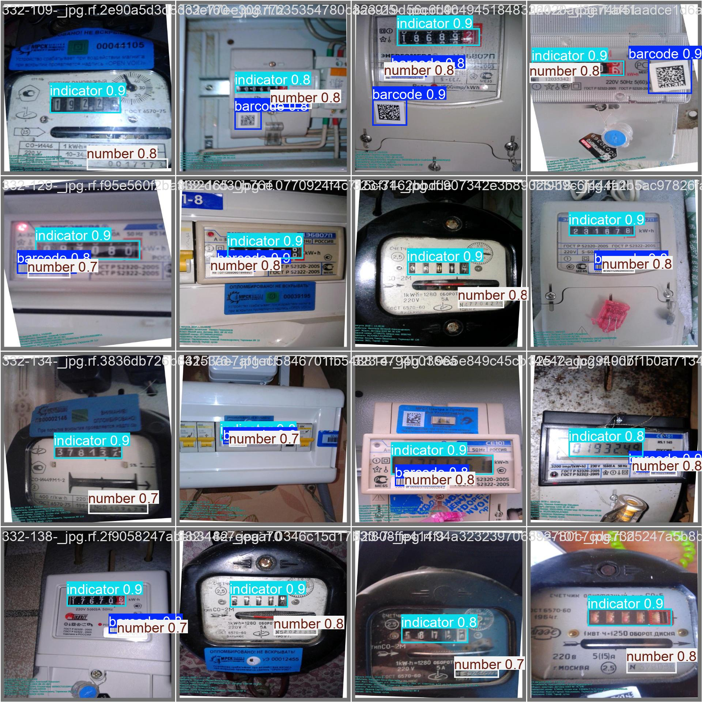

# Обучение модели
Обучение выполнялось на Kaggle. [Ноутбук](train-emeter-detector.ipynb), с помощью которого выполнялось обучение. 

## Графики функций потерь и метрики качества

Графики функций потерь убывают от эпохи к эпохе. Графики метрик возрастает от эпохи к эпохе.

## Precision-Confidence Curve (PCC)

С увеличением confidence значение precision стремиться к 1, что хорошо. Немного провалился класс number.

## Визуализация предсказаний в процессе валидации

Пример работы модели на валидационной выборке демонстрирует уверенную детекцию классов: indicator, number, barcode.

## Результат работы модели на тестовой выборке
| Количество изображений в тестовой выборке | Количество изображений с детекцией | % с детекцией | Количество электронных с детекцией | Количество старых аналоговых с детекцией | Количество современных аналоговых с детекцией | Среднее значение confidence | Минимальное время обработки (сек) | Среднее время обработки (сек) | Максимальное время обработки (сек) | Выполнена детекция, где изображение повернуто на 90 гр. | Выполнена детекция, где изображение повернуто на 180 гр. | Выполнена детекция, где изображение повернуто на 270 гр. |
| ----------------------------------------- |------------------------------------|--------------|------------------------------------|------------------------------------------|-----------------------------------------------|-----------------------------|-----------------------------------|-------------------------------|------------------------------------| ------------------------------------------------------ | -------------------------------------------------------- |----------------------------------------------------------|
| 69                                        | 62                                 | 0,9          | 17                                 | 22                                       | 23                                            | 0,8579                      | 0,15                              | 0,21                          | 0,34                               | 0,6666666667                                           | 1                                                        | 1                                                        |

